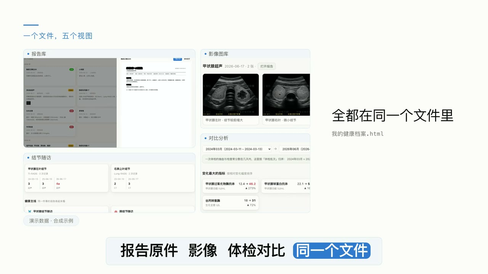

# health-report-agent

**把散落各处的体检、检验、影像报告，变成一个双击就能打开的单文件 HTML 健康看板。**
不是又一个网页模板——你把这个目录交给 Claude Code / Codex 之类的 agent，
它会**引导你把报告弄到手**、读懂内容、生成页面。全程本地，不上传任何数据。

> **English readers → [README.en.md](README.en.md)** — full English version.
> (The step-by-step retrieval guides stay in Chinese: they target Chinese hospital
> portals and mini-programs, where the concrete steps are what matter.)

**▶ 在线看效果：[演示页](https://ghbhiee.github.io/health-report-agent/)** ← 数据全部虚构

**▶ 30 秒看懂：[介绍视频（在线直接播放）](https://ghbhiee.github.io/health-report-agent/#video)**

[](https://ghbhiee.github.io/health-report-agent/#video)

<sub>（GitHub 的 raw 链接会触发下载而不是播放，所以视频挂在 GitHub Pages 上，点开即播。）</sub>

---

## 为什么要做这个：不只是自己存着，是**带去给医生看**

自己留档只是一半。真正的痛点在诊室里：

医生问「你这个指标以前是多少？」——你打开手机相册翻截图，或者从包里掏出一沓纸，
一份份找、一个个念。**几分钟的问诊时间，一大半花在找资料上**。而医生真正想知道的
往往不是某一次的数值，是**趋势**：这项一直这么高，还是最近才升的？上次是什么时候查的？
当时的参考区间是多少？

这个看板就是为这个场景做的：

- **一屏看完趋势** —— 每项指标的多年折线，带参考区间带，哪次偏离一眼就见
- **点一下就能翻到原件** —— 医生要核对时，报告 PDF 原件就内嵌在同一个文件里，不用另外找
- **随身带得走** —— 就一个 HTML 文件，手机、平板、U 盘、发邮件给自己都能打开，
  **不需要网络、不需要装任何东西**，诊室里没信号也能用
- **换医院、换医生也不用重来** —— 你的档案在你自己手里，不锁在某家医院的系统里

顺带也解决了另一个现实问题：**各家医院的系统互不相通**。在 A 医院做的检查，
B 医院的医生看不到。这个文件是你自己那份完整的、跨医院的记录。

> ⚠️ 它**不做诊断**，也不替你解读。它做的是把你已有的报告重新组织好，
> 让医生把时间花在判断上，而不是花在翻资料上。所有结论仍以医生的意见为准。


## 它做出来的是什么

一个 HTML 文件，5 个视图：

- **概览** — 需要关注的指标、结节分级随访、健康主线、全部检查的时间轴
- **化验趋势** — 每项指标随时间的趋势图，带参考区间带；可只看偏离项、可搜索
- **报告库** — 按类型 / 年份 / 状态筛选，点开抽屉看结论、偏离项、**内嵌的 PDF 原件**
- **影像图库** — 从报告里提取出来的超声 / 内镜图，灯箱可翻页缩放
- **对比分析** — 选两次体检批次，列出变化最大的项目

页面**零外链、零 fetch**，所有 PDF 和图片都内联在这一个文件里。断网、拷到 U 盘、
发给家人都能直接打开。

## 三步上手

```bash
# 1. 拿到代码，装依赖（纯 Python，无 OCR 引擎）
git clone https://github.com/ghbhiee/health-report-agent.git
cd health-report-agent && pip install -r requirements.txt

# 2. 用你的 agent 工具打开这个目录
claude          # 或 codex，或任何能读 AGENTS.md 的工具

# 3. 告诉它：「帮我把体检报告做成健康档案」
```

**第一次用？直接说 `/onboarding`** —— 它会一步一停地带你从「先看演示」走到
「拿到自己的看板」，不用先读文档。

## 常用命令

这些是 slash 命令（Claude Code 里直接输入；其它工具就用右边那句话说给它听）：

| 命令 | 用大白话说 | 做什么 |
|---|---|---|
| `/onboarding` | 「我第一次用，带我走一遍」 | 从看演示到出成品，一步一停 |
| `/collect` | 「帮我把报告收进来」 | 问清数据在哪，按路线引导你拿到手，落到 `workspace/inbox/` |
| `/extract` | 「把这些报告读成数据」 | 勘探 + 三层抽取，对照 9 个数据坑排查 |
| `/build` | 「生成我的健康档案」 | 写 build 脚本 → 拼成单文件 HTML |
| `/verify` | 「检查一下有没有问题」 | 契约合规、零外链、偏离标记与报告 ↑↓ 交叉校验 |

也可以完全不记命令，直接说人话：「帮我把体检报告做成健康档案」「我又有新报告了，更新一下」。

常用的裸命令（不依赖任何 agent）：

```bash
python3 demo/make_demo.py && python3 -m webbrowser -t demo/index.html   # 看演示，顺便理解数据契约
python3 tools/probe.py workspace/inbox              # 勘探：每份文件是什么、有没有文字层、有几张图
python3 tools/extract.py text  <file.pdf>           # 有文字层：直接取全文
python3 tools/extract.py pages <file.pdf>           # 没文字层：渲染成图，交给 agent 看
python3 tools/verify.py data.json assets.json out.html   # 生成后校验
python3 tools/scan_privacy.py                       # 确认没有隐私数据混进 git
```

## 报告怎么弄到手

三条路线，agent 会问你走哪条。**最常见的是第二条**：

**① 已经有 PDF / 照片** — 最省事，丢进 `workspace/inbox/` 就行。

**② 报告在医院的微信小程序 / 公众号里**（国内最常见）
医院小程序本质是个魔改的浏览器，报告本身就是网页，它解决的只是登录。所以不要折腾小程序，把它搬到电脑上：

1. 电脑上登录**微信 PC 版** → 找到医院的小程序或公众号 → 进到报告列表页；
2. 在报告页点右上角「···」→「**复制链接**」，或者直接「**在浏览器中打开**」；
3. 粘到电脑 Chrome 打开（有的医院会再要一次手机号+验证码，自己过一下）；
4. 装上 **Claude in Chrome / Codex 浏览器扩展**（Chrome 内置 AI 侧边栏也行），
   在这个已登录的页面上，把下面这段**整段贴给它**：

```text
帮我提取这个页面里的所有检查报告数据，按下面的要求做：

1. 每一份报告都单独存成一个 PDF，文件名用「序号_日期_检查名称.pdf」的形式。
2. 如果是数字影像类的检查（超声、内镜、病理这些带图的），把「图文报告」也下载下来，
   图文报告本身就是 PDF。
3. 把所有报告里的数据抽取到一个 Excel 里：
   · 按不同的检查项目分 sheet（比如血常规一个 sheet、生化一个 sheet、尿常规一个 sheet），
     每个 sheet 里一行一个指标，列出：检验项目、结果、单位、参考区间、是否偏高/偏低；
     同一项目做过多次的，按检查日期分列，方便看趋势。
   · 再加一个「汇总」sheet，列出所有报告：序号、报告名称、报告类型、报告日期、
     主要结果或结论、是否异常。
   · 汇总 sheet 最后加一列「溯源PDF(本地)」，写这份报告对应的本地 PDF 相对路径，
     让我之后能从表格点回原件。
4. 报告日期范围请覆盖列表里能查到的全部时间，不要只取最近几个月。
5. 最后告诉我：一共下载了多少份 PDF、Excel 里有几个 sheet，以及有没有哪份没拿到。
```

抓完把整包丢进 `workspace/inbox/`。Excel 只是加速，**PDF 原件才是准的**——
后面 `tools/verify.py` 会拿推导出的偏离标记和报告上印的 ↑↓ 对撞。

**③ 能在电脑上直接登录医院官网 / 体检机构系统** — 同样是装扩展 + 贴上面那段提示词。

链接搬不动、或者只能看不能下？降级到手机长截图，交给 agent 读图，一样能做。
细节见 [`docs/11-acquire-mobile.md`](docs/11-acquire-mobile.md) 与
[`docs/10-acquire-browser.md`](docs/10-acquire-browser.md)。

> **红线**：agent 绝不会代你输入账号、密码或短信验证码——登录始终由你自己完成，
> 它只在你已登录好的页面上做导航和下载。

想先看看契约长什么样，不用读文档，跑一遍合成 demo：

```bash
python3 demo/make_demo.py && python3 -m webbrowser -t demo/index.html
```

## 隐私

这是**个人健康数据**，所以整个项目按"数据不出本机"设计：

- 你的原始文件和产物都在 `workspace/`，**已被 `.gitignore` 排除**，不会误提交。
- 产物 HTML **零外链零 fetch**，打开后不联网、不回传，`tools/verify.py` 每次生成都会重新验证这一点。
- 仓库里**没有任何真实病历数据**。`demo/` 里的姓名、日期、化验值、影像图**全部是合成的**。
- agent 被明确禁止：代你输入账号密码或验证码、把你的数据上传到任何服务、对报告做医学判断。
  详见 [`AGENTS.md`](AGENTS.md) 的红线一节。

## 不做什么

**不做医学诊断。** 页面只是把你已有的报告重新组织展示——结论、分级、随访建议一律
照抄报告原文。任何解读请以医生意见为准，页脚的免责声明请保留。

## 依赖与平台

| | |
|---|---|
| Python | 3.9+ |
| 依赖 | `pymupdf` `pillow` `numpy` `openpyxl` —— 纯 Python，`pip` 一次装完 |
| 平台 | macOS / Linux / Windows |
| OCR 引擎 | **不需要**。有文字层的 PDF 直接读；没有文字层的图**由 agent 自己看**（它本来就是多模态模型） |
| agent 工具 | Claude Code 读 `CLAUDE.md`，Codex 读 `AGENTS.md`，其它工具手动 `@AGENTS.md` 即可 |

## 关于产物体积

PDF 原件是内嵌的，所以报告多了文件会大——真实数据里 20~50 份报告大约 **10–35MB**。
不想要这么大，可以在 `build_assets.py` 里**跳过 `pdf*` 资产、只保留页面渲染图**，
体积能降到 1/5 左右，代价是抽屉里不能下载 PDF 原件、只能看渲染页。

## 文档

| | |
|---|---|
| [`AGENTS.md`](AGENTS.md) | **agent 的主入口**，人也可以读，一页讲完全流程 |
| [`docs/00-overview.md`](docs/00-overview.md) | 心智模型与整体流程 |
| [`docs/10-acquire-browser.md`](docs/10-acquire-browser.md) | 从医疗平台用浏览器批量下载 |
| [`docs/11-acquire-mobile.md`](docs/11-acquire-mobile.md) | 手机小程序里的报告怎么弄到电脑 |
| [`docs/12-acquire-manual.md`](docs/12-acquire-manual.md) | 已有 PDF / 照片 / 录屏怎么交给 agent |
| [`docs/20-extract.md`](docs/20-extract.md) | 三层抽取策略 + 9 个反复出现的数据坑 |
| [`docs/30-build-verify.md`](docs/30-build-verify.md) | 生成与浏览器验收清单 |
| [`docs/DATA_CONTRACT.md`](docs/DATA_CONTRACT.md) | 三个 JSON 的精确字段定义 |

## 作者

Guo Hongbo · <guohongbo@outlook.com>

## License

MIT，见 [`LICENSE`](LICENSE)。
